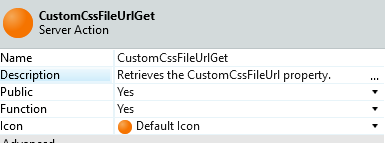
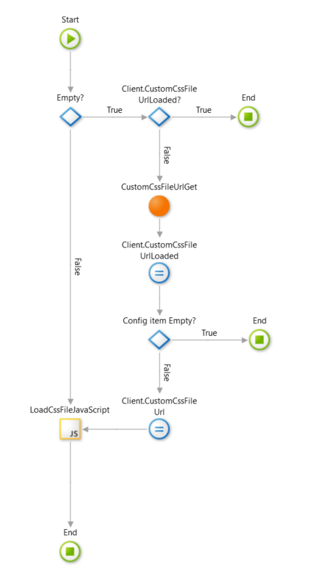

# How to Dynamically Import the Customized Product Theme in the Base Product
When developing a product application for a customer, it may be that different instances are going to use it. You can image that in some cases, specific customizations are necessary, adjusted to their specific use case. For example, the application requires a different look-and-feel per country. Or some tweaks are needed in a simple user interaction. This lesson [How to Create Customized Versions of a Base Application](https://success.outsystems.com/Documentation/Best_Practices/Architecture/How_to_Create_Customized_Versions_of_a_Base_Application) describes the architecture of a product that is meant to be customized in different installations.
This architecture for the standard product look like this:

One of the challenges is applying the styling of the customized product to the base product. As shown in this sheet 
In this how-to we give you step by step instructions how to achieve this.
## Implementation steps for Reactive Web Applications
*	Create the **Base Product Theme** and apply the base styling such as fonts and colors.
*	Create a **Customized Product Instance Theme** e.g. `ACME Theme` and apply the custom styling
*	In the **Configuration Services** application create a **ConfigurationServicesCustom** service module that will hold configuration items. See the [Application Framework](https://www.outsystems.com/forge/component-overview/5944/application-framework) for an example how to create configuration items.
*	In the **ConfigurationServicesCustom** module create a Configuration Item to hold the full URL path to the _“CustomizedProductInstanceTheme” CSS file_ e.g.
`<server path>/AcmeTheme/AcmeTheme.css` named `CustomCssFileUrl`.
*	In the **CustomizationsServices_CS** module create a Server Action `CustomCssFileUrlGet` which sets the output variable `CustomCssFileUrl` to the value of the configuration item:

*	In the **BaseProductTheme** module create a Client variable `CustomCssFileUrl`
*	In the **BaseProductTheme** module create a Client action `ClientCustomCssFileUrlSet` that assigns the output of `CustomCssFileUrlGet` to the client variable   
*	In the **BaseProductTheme** create a public Client action `LoadCustomCssFile with` the following logic: Screenshot of LoadCustomCssFile properties

* Insert the following code in the JS block:

```javascript
var filesadded=""; //list of files already added

function checkloadcssfile(filename){
    if (filesadded.indexOf("["+filename+"]")==-1){
        loadcssfile(filename);
        filesadded+="["+filename+"]"; //List of files added in the form "[filename1],[filename2],etc"
    }
}
// example
// checkloadcssfile("myscript.css") //success
// checkloadcssfile("myscript.js") //redundant file, so file not added

function loadcssfile(filename){
        var fileref=document.createElement("link");
        fileref.setAttribute("rel", "stylesheet");
        fileref.setAttribute("type", "text/css");
        fileref.setAttribute("href", filename);
    if (typeof fileref!="undefined")
        document.getElementsByTagName("head")[0].appendChild(fileref);
}

checkloadcssfile($parameters.fileName); //dynamically load and add this .css file
```

*	Switch to the interface tab and locate the `LayOuts` UIFlow. For each layout open the `OnReady` client action and add the `LoadCssFile` to the action flow. E.g. `LayoutTopMenu`:  
*	Open the **Customization Services Configuration Backoffice** and set the value of the `CustomCssFileUrl` configuration item to the *full url path* of the customized product theme CSS file. Now every screen based on the layouts will load the CSS and apply the styling of the customized product instance.
