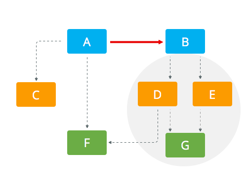
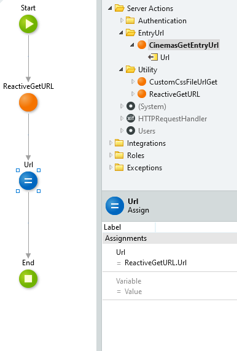
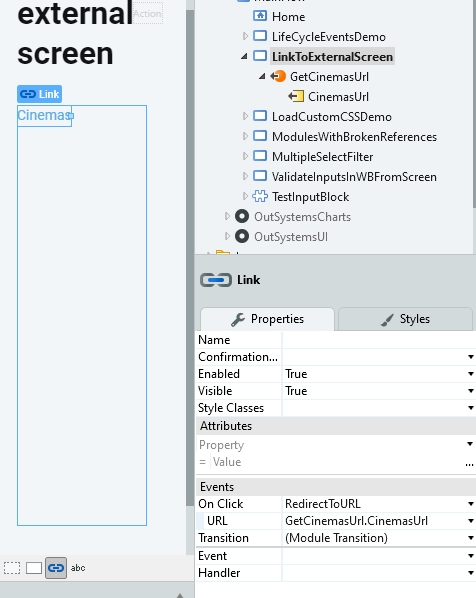

# How-to connect Screens across modules without violating the layered architecture reference rules in OutSystems 11
A quick guideline on referencing screens in accordance with the layered architecture.
## Introduction
*This article is targeted at OutSystems version 11 Reactive Web applications for previous versions and traditional web applications see [How-to connect OutSystems Web Screens across eSpaces without violating the 4 layer canvas reference rules](https://itnext.io/how-to-connect-outsystems-web-screens-across-espaces-without-violating-the-no-side-reference-rule-b03f8aae16ac)*

If you want to connect to a screen from another module you may not make the screen public and create a reference to it. Doing so would be a violation of the No side references among **End-user modules** rule as described in [Validating your application architecture](https://success.outsystems.com/Support/Enterprise_Customers/Maintenance_and_Operations/Designing_the_Architecture_of_Your_OutSystems_Applications/Validating_your_application_architecture).
This article gives you a step by step guideline how to make a reference in accordance with the architecture rules.
The picture below illustrates that when A references B, A unnecessarily inherits the cluster D,E,G

## Implementation steps
To illustrate the steps we'll create a link to the OSMDb Cinemas screen from the HowToLinkToWebScreens module.
### Step 1 Create a Server Action to retrieve a reactive url
* Open the `HowToLinkToWebScreens` module and open the Manage dependencies window (Ctrl + Q). Add the `HTTPRequestHandler/GetEntryUrl` dependency.
* Create a new server action (Ctrl +N) and name it `ReactiveGetEntryUrl`. Add a output parameter of type text and name it `Url`. Set function to Yes.
* Navigate to the `GetEntryUrl` action and copy all the input parameters to the `ReactiveGetEntryUrl` action.
* Add a `GetEntryUrl` to the actionflow
* Add the following assign: `Url = Replace(GetEntryURL.URL, ".aspx", "")`
The action should now look like this 

### Step 2 Create a ServerAction to retrieve the screen url
* Create a new server action (Ctrl +N) and name it `CinemasGetEntryUrl`. Add a output parameter of type text and name it `Url`. Set function to Yes.
* Add a ServerAction `ReactiveGetEntryUrl` to the actionflow, set the `EspaceName` to "OSMDb" and `ScreenName` = "Cinemas"
* Add an assign to set Url to the `ReactiveGetEntryUrl.Url`
This action should now look like this: 
### Step 3 Create the link to the web screen
* Open the web screen from where you want to create the link.
* Add a fetch data from other sources action and name it `GetCinemasUrl` and rename the output parameter to CinemasUrl
* Add the `CinemasGetEntryUrl` to the action flow
* Add an assign to set `CinemasUrl` to `CinemasGetEntryUrl.Url`
* Switch to the screen canvas and add a **link** widget to the screen
* Set the text inside the link to "Cinemas"
* Set the On Click event to `RedirectToUrl` and set the destination to **ExternalUrl**.
* Set the Url parameter to `GetCinemasUrl.CinemasUrl`.

This method can easily be applied to screens with parameters by providing the parameters to the `ReactiveGetEntryUrl` server action.

## Solution Architecture
By applying the steps above we created an architecture where web screens are referenced by other modules without side references in the UI layer

## Conclusion
Using `ReactiveGetEntryUrl` can help you to avoid creating references to **End-user** modules. This ensures that they are correctly isolated, allowing them to have different lifecycles — different versioning paces due to different sponsors or project teams.
This isolation is critical since **End-user modules** are at the top of the hierarchy. A reference to such modules tends to bring along a huge set of indirect dependencies from lower layers.

## Points of attention
Changing the name of the **Module**, the **Screen** or it’s **parameters** will result in a *broken Url*. This is the same situation as when you link to a page from an external web site and the page is changed or deleted.
## Enhancements
* Instead of the `<screenentry>GetEntry()` action you can create a Service Action in a core services module to reduce the impact of changes e.g. `CinemasGetEntryUrlOAPI`.
* You also can put the URL's in a (static) entity in a core service module combined with Service Actions. This will centralize the entry maintenance.
