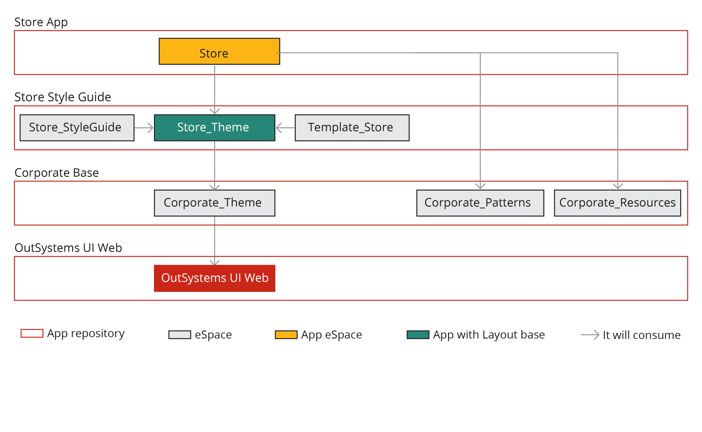

# How to create the Store Application Front End Architecture

## Stare applcication Front-End Architecture

The Front-End architecure consist of the following applications and modules:

|Application | Module | Desription |
|------------|--------|------------|
| Store | `Store` | App created with the `Template_Internal` |
| Store Style Guide | `Store_StyleGuide` | - |
|  | `Store_Theme` | Based on the `Corporate_Theme` |
|  | `Template_Store` | Internal application reactive template |
| Corporate Style Guid | `Corporate_Theme` | Library module with the corporate style |
|  | `Corporate_Patterns` | Corporate widgets |
|  | `Corporate_Resources` | Library with reusable resources |

## Install Style Guide assets from the forge

We will use the OutSystems UI Style Guide applications to jumpstart the creation of the frond-end architecture.

Asset | Description
---------|----------
 [OutSystems UI Style Guide Theme](https://www.outsystems.com/forge/component-overview/8240/outsystems-ui-style-guide-theme) | This component enables you to create your own Style Guide theme for Reactive and Mobile apps.
 [OutSystems UI Reactive Style Guide Template](https://www.outsystems.com/forge/component-overview/7526/outsystems-ui-reactive-style-guide-template) | Create new Reactive applications based on the Style Guide |
 [OutSystems UI Mobile Style Guide Template](https://www.outsystems.com/forge/component-overview/8241/outsystems-ui-mobile-style-guide-template) | Create new Mobile applications based on the Style Guide |
 [Style Guide Preview](https://www.outsystems.com/forge/component-overview/7527/outsystems-ui-style-guide-preview)| Application to preview Styles, UI Patterns, Widgets and Screen Templates

## Create the Corporate Styles Application

This application contains the rules to customize your Corporate Styles. These are based on the OutSystems UI and new Corporate Styles patterns.

### Create the theme application

1. Open Service Studio and click on New Application
1. Select from scratch
1. Select Reactive Web App (This app will be based on OutSystemsUI)
   1. Name: Corporate Style Guide
   1. Description: Corporate styles and patterns
   1. Upload logo: the corporate logo
1. Create the application

### Create the corporate style theme

We clone the OutSystems UI Style Guide Theme modules so that ...

1. Open module `StyleGuideTheme` (Ctrl+o)
1. Clone the module (Module > Clone)
1. Close module `StyleGuideTheme`
1. Rename `CloneOfStyleGuideTheme` to `Corporate_Theme`
1. Go to the interface tab (Ctrl+2)
1. Rename theme `StyleGuideTheme` to `CorporateTheme` and change the description to *Corporate Theme*
1. Convert the module to a library module: Module > Convert > Convert to library module
1. Confirm the conversion and publish the module
1. Close the module
1. Open application Independent modules and move the `Corporate_Theme` to application 'Corporate Style Guide'

### Add style rules to the them

// TODO Use theme editor steps from Orders tutorial

1. Open module `Corporate_Theme`
1. Change the logo 
You can now edit the css to add any addional style rules to overide the OutSystemsUI classes or add your own.

### Create a corporate assets library

Create a corporate asset library to be reusable in your applications.

1. With the SCC Corporate Style application open create a new module
   * Name: SCCCorporateAssets_Pat
   * Module type: Library
   * Click on Create module
1. Set the description to: Add theme assets to be reusable in your applications.
1. Add a dependency to the SCCCorporateStyleTheme
1. In the module properties set the default theme to SCCCorporateStyleTheme
1. Publish the module
1. Close the module

Your Corporate style application is now complete

## Create the Corporate Reactive Style Guide Template

Because we want to share common elements we need to customize the template and set the home screen destination.

### Create the Corporate Reactive Style Guide Template Module

1. Open module Template_ReactiveStyleGuide
1. Clone the module (Module, clone)
1. Close module Template_ReactiveStyleGuide
1. Rename the cloned module to Template_SCCReactiveStyleGuide
1. Set the descriptio to ....
1. Open manage dependecies and add a dependency to SCCCorporateStyleTheme_Th/SCCCorporateStyle theme
1. In the theme folder select the StyleGuideTheme and Find Usages (F12)
1. Replace all usagages with your corporate thene (SCCCorporateStyleTheme)
1. Remove the StyleGuideTheme\StyleGuideTheme (Theme) dependency
1. Select the module properties (Template_SCCReactiveStyleGuide)
1. Set the default theme to SCCCorporateStyleTheme
1. Delete Themes/Template_ReactiveStyleGuide theme (This will ensure that applcations not have local styles)
1. Set the module's icon to your corporate logo. (SiriusCyberneticsCorp.png)
1. Verify that the template is available in the New Aplpication selection screen
1. Delete OutSystems UI Reactive Style Guide Template as we no longer need it.

### Create Create the Corporate Reactive Style Guide Template Application

1. In service stutio click on create new application
1. Select from scratch
1. Select SCC Reactive Style Guide
    1. Name:  SCC Corporate Reactive Style Guide Template
    1. Description: SCC Corporare templates to start creating Reactive Web applications and screens.
    1. Upload logo: A logo that represents the app.
    1. Create the application
    1. Do **not** create a module 
1. Open application Independent modules
1. Move module Template_SCCReactiveStyleGuide to application SCC Corporate Reactive Style Guide Template

## Create SCC Corporate Theme

We want to establish a shared layout and login experience therefore we must move some components to a shared ui module

### Create SCC Internal Apps application

1. Create a new application
   1. Name SCC Internal Theme
   1. Description: TODO
   1. Upload icon: An icon that represents the app.
   1. Create App

### Create Create SCC Internal Theme module

1. Create Module
   * Name: SCCCorporateTheme
   * Module type"recative web app
1. Publish the module
1. Rename UI Flow Commmon to SCCThemeCommon
1. Make the following elements Public
   UI Flow SCCThemeCommon:
   * Invalid Permissions
   * Login
1. Delete Ui Flow MainFlow - We won't be creating screens inside this module
1. Publish the module

### Reference the theme from the Template

1. Open module Template_SCCReactiveStyleGuide
1. Manage Dependencies
1. Add a dependency to all elements of SCCCorporateTheme
1. Replace Layouts/LayOutTopMenu with Layouts2/TopMenu
1. Delete Layouts/Topmenu
1. Replace Layouts/LayoutBlank with Layouts2/LayoutBlank
1. Delete Layouts/LayoutBlank
1. Delete UI Flow Layouts
1. Rename Layouts2 to Layouts
1. Replace Common/InvalidPermissions with SCCCorporateCommon/InvalidPermissions
1. Delete Common/InvalidPermissions
1. Replace Common/Logion with SCCCorporateCommon/Login
1. Delete Common/Login
1. Delete Common/Menu
1. Delete Common/ApplicationTitle
1. Delete Common/MenuIcon
1. Delete Common/UserInfo
1. Delete Client Variable Username
1. Delete Server Actions folder Authentication
1. Publish the module

## References

* [Course - Style Guide Architectures](https://www.outsystems.com/training/courses/71/style-guide-architectures/)
* [How to Build a Front-End Architecture in OutSystems](https://success.outsystems.com/Documentation/How-to_Guides/Front-End/How_to_Build_a_Front-End_Architecture_in_OutSystems)
