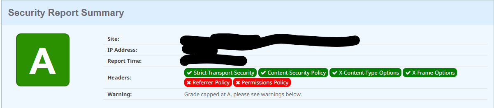

# Step by step instructions to secure your Applications.

Before applying the settings we check the headers of your application at [securityheaders.com](https://securityheaders.com).
This are the initial results:


Ample room for improvement here!

## Configure secure connections for an Environment

Do the following in the infrastructure management console (LifeTime):

1. Select the "Environments" section to see all environments.
1. Select the environment that you want to configure by clicking on it.
1. Click the "More Security Settings" link on the bottom section of the page.
1. Configure the security settings.
1. Switch **Enable HTTP Strict Transport Security (HSTS)** On
1. Switch **Force HTTPS for exposed integrations in Web Applications** On
1. In the Cookies section switch **Secure** On
1. Switch **Enable Content Security Policy** On
1. Save, this will create the default csp directives
1. Edit the CSP Directives to add values below:

    | Directive | Value(s) |
    | --------- | -------- |
    | Font-src | self<br>data:<br>`https://fonts.gstatic.com` |
    | Object-src | `none` |
    | Style-src | self<br>`https://fonts.googleapis.com` |
    | Other Directives | `require-trusted-types-for 'script';` |

1. Save the settings (We now have to republishe the apps to apply the changes.)
1. Go to the enviroments service center
1. There will be a message "Environment settings are pending. [Apply Settings to the Factory](x)"
1. Click on "Apply settings to the factory.
1. Go to Factory > Solutions
1. Create and publish a new solution "All"
    1. Name: `All'
    1. Go to tab components and click on "Associate All Modules/Extensions"
    1. Click on Save to save the solution
    1. Go the versions tab
    1. Select the current running version and click on "Publish"
    1. Click on Ok to confirm the action.
1. Check the headers of your application at [securityheaders.com](https://securityheaders.com). 
1. Validate the CSP at [csp evaluator](<https://csp-evaluator.withgoogle.com/>)   (We ignore the 'unsafe-inline' error as it is inserted by the platform)

## Adding headers with the Factory Configuration App

:warning: **Warning:** Do use this in Personal Environments.

We now have to add the reported **Referrer-Policy** and **Permissions-Policy**. For this we will use the Factory Configuration forge component.

1. Install the [Factory Configuration](https://www.outsystems.com/forge/component-overview/25/factory-configuration) app from the forge.
1. Navigate to Factory Configuration > Shared Configurations > Create New Shared Configuration;
1. Insert the following content in the form of the Shared Configuration:

    **Name:** A name that you find appropriate and indicates what the setting does, e.g., *'Security Headers'*

    **Kind:** Select *'web.config_XSL'* from the dropdown.

    **Value**: The XSL template that finds the element `/configuration/system.webServer/httpProtocol/customHeaders` and adds to it a new add element.

    ```xml
    <?xml version="1.0" encoding="UTF-8"?>
    <xsl:stylesheet version="1.0" xmlns:xsl="http://www.w3.org/1999/XSL/Transform">

        <xsl:output method="xml" indent="yes" encoding="UTF-8"/> 

        <xsl:template match="@*|node()">
            <xsl:copy>
                <xsl:apply-templates select="@*|node()"/>
            </xsl:copy>
        </xsl:template>
     
        <xsl:template match="/configuration/system.webServer/httpProtocol/customHeaders">
            <xsl:copy>
                <xsl:apply-templates select="@*|node()"/>
                <add name="X-Frame-Options" value="SAMEORIGIN" />
                <add name="X-XSS-Protection" value="1; mode=block" />
            </xsl:copy>
        </xsl:template>

    </xsl:stylesheet>
    ```

    To set the Referer-Policy header insert this add statment:

    ```xml
    <add name="Referrer-Policy" value="no-referrer" />
    ```

    To set the Permissions-Policy header insert this add statment:

    ```xml
    <add name="Permissions-Policy" value="accelerometer=(), ambient-light-sensor=(), autoplay=(), battery=(), camera=(), cross-origin-isolated=(), display-capture=(), document-domain=(), encrypted-media=(), execution-while-not-rendered=(), execution-while-out-of-viewport=(), fullscreen=(), geolocation=(), gyroscope=(), keyboard-map=(), magnetometer=(), microphone=(), midi=(), navigation-override=(), payment=(), picture-in-picture=(), publickey-credentials-get=(), screen-wake-lock=(), sync-xhr=(), usb=(), web-share=(), xr-spatial-tracking=(), clipboard-read=(), clipboard-write=(), gamepad=(), speaker-selection=(), conversion-measurement=(), focus-without-user-activation=(), hid=(), idle-detection=(), interest-cohort=(), serial=(), sync-script=(), trust-token-redemption=(), window-placement=(), vertical-scroll=()"/>
    ```

1. After creating the template, we need to associate it to the module(s). To do this, one has to:

    Navigate to Factory Configurations > eSpaces;

    Select the eSpace(s) that that requires having this setting;

    In the eSpace page, select the Shared Configuration created in step 3 from the dropdown and click the Associate button.

    Apply settings to the mentioned eSpace(s) for the configuration to be effective. You can do this by adding the necessary eSpace(s) to a Solution and publishing it.

## Additional CSP settings on application level

We created an application with a product entity that contains an url to an external resource for the product picture. To be able to show the image we must add this resource domain in the Apps csp settings.

First we check the Error logs to see what's blocked:

1. Open Service Center
1. Go to monitoring
1. Select Errors
1. Enter "CSPReport" in the source filter field and click on filter
1. You will now see the CSP errors e.g,: `Content Security Policy blocked 'https://i.ibb.co/xDXpRt6/Automaticant.jpg'.`

We will now add `https://i.ibb.co` to the applications CSP directives:

1. Open LifeTime
1. Go to Applications
1. Select \<your application\>
1. Click on \<your application\>
1. Click on "Settings"
1. Turn **Enable Content Security Policy** On
1. Add `https://i.ibb.co` to directuve **Img-src**
1. Click on Apply and confirm the action. You will now see a message : `Changes saved. The application needs to be published to use the new settings.`
1. Open to Service Center
1. Go to Factory > Applications
1. Select \<your application\>
1. Click on \<your application\>
1. Click on [Publish] to republish the application and apply the new settings.
1. Open the application to verify that there are no more errors
