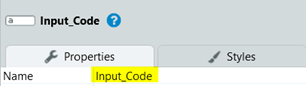
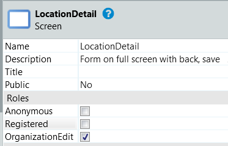
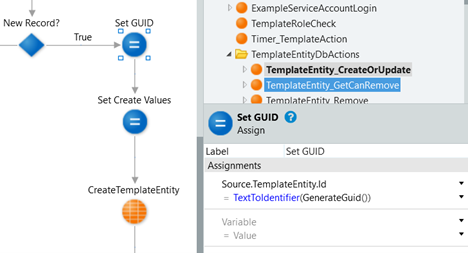
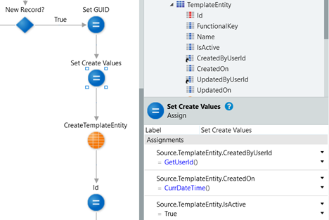
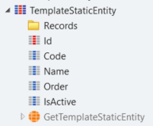
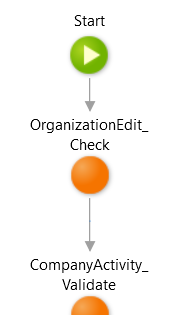

# Programming standards

Because OutSystems offers a comprehensive set of best practices on how to develop an application Service Studio and we really value the professionalism of our developers, we are very reluctant in providing strict programming
standards. We expect all developers to follow the Outsystems best
practices and apply these in their own programming style, while being
able to deal with other people's programming styles.

However, some issues must be addressed in order to make sure the
development, test, delivery and maintenance processes will run smoothly.

Here is a list of issues that we find important.

## Service Studio Version

The OutSystems best practice is: Everyone in the team should use the
same Service Studio version. See
<https://success.outsystems.com/Documentation/Best_Practices/Development/OutSystems_Platform_Best_Practices>

The OutSystems Architect decides what version must be used and will
review this periodically.

Due to the frequent updates and bug fixes, we use the latest version, which can be downloaded here: <https://www.outsystems.com/Downloads/>

## In general

### Service Studio warnings

No warnings should exist in delivered modules. Outsystems does a great
job in identifying sub-optimal programming, and we really expect the
same standards from our developers. However, there are circumstances in
which there are good reasons to override a warning, and if so: this must
be documented with a note explaining the reason for the override in the
diagram and the warning must be hidden. Obviously, such an override will
attract attention during code review.

### The use of NullTextIdentifier() vs. ""

Although this is common Outsystems knowledge, we sometimes experience
some confusion about the correct use of these two methods for
establishing whether or not a Text type attribute is empty, especially
because Service Studio is overly relaxed about this difference. Here are
the rules:

* Use NullTextIdentifier() only when applying it to an attribute of type
\[Entity\]Identifier, where the underlying type of the attribute is
Text.
* Use "" in all other cases, i.e. when applying it to an attribute of type
Text that is not an identifier.

The underlying issue here is that Outsystems generates a NULL for
NullTextIdentifier() when using it in the context of an SQL statement.
Comparing this to an empty column of type string will return FALSE, as
an empty string in e record is represented as "" in the database.

### Avoid using literals in code

With the one main exception of screen labels, as a general rule, we
avoid using literals in code. Scattering literals across the code base
makes it very difficult to trace them and to consistently maintain them.

Here are some approved ways to avoid this:

1. Use Notifications (see [How to add and use notifications](https://synobsys2013-my.sharepoint.com/wiki/spaces/STIP1/pages/125141256/How+to+add+and+use+notifications)) for messages that are displayed to the user or consumers of services. This may be a little more labour-intensive, but the payback is huge, as this centralizes the literals for the messages in a single repository (per domain).
1. Use static entities to supply literals based on identifiers
1. Use "CONST_" functions for constants, such as default values. These are client or server actions that return a value, recognizable by their name (CONST\_\[VariableName\] with their Function attribute set to True. This makes a constant much more explicit and easier to find (or change, for that matter) than for example setting a default value for a variable.

Don't:

* assign a literal to a variable, except for variables that directly and only set screen labels
* test the value of a variable against a literal

## UI programming (screens and blocks)

### Widget identifiers

All widgets from one of the following categories MUST have a unique and
meaningful identifier (also known as 'Property ID'):

This is to make them addressable in (automated) test tooling.

Widget types:

1. Data input (input, text area, checkbox, search, date picker, etc.)
1. Data output (expression, image, icon)
1. Interaction (button, switch, dropdown, link, etc.)

### Screen access permissions

Each screen must have **ONE** specific access role assigned to it.

Except for special cases, it is not allowed for a screen to have
Anonymous or Registered roles. The screen's design or User Story must
specify the required access right. See [How to add and use access rights
(roles)](https://synobsys2013-my.sharepoint.com/wiki/spaces/STIP1/pages/196673764) for more information on access rights.

To prevent confusion and keep the access policies clean and simple,
assigning more than one role is not permitted.

### Styles

A main principle here is that it is not allowed to have custom styling
in screens or blocks. First of all, all styling must be done using
CSS classes, which then must reside in the Global style sheet
(GlobalStyleGuideTheme).

In order to maintain consistency, the maintenance of the Global style
sheet is the responsibility of the Outsystems Architect. Development
teams are prohibited to make changes to this style sheet.

However, to avoid waiting time, new (sub)classes may be created locally
during development when needed, but should be registered with the
Outsystems Architect so that they can be properly included in the Global
style sheet. The Outsystems Architect will communicate the update, after
which the developer must remove the custom class(es) from the screen or
block. This must be done before the User Story is ready.

### Notifications

Text for messages that are to be shown to the user (errors, warnings and
informational) must be implemented through Notifications. The use of
literal texts is not allowed. See [How to add and use
notifications](https://synobsys2013-my.sharepoint.com/wiki/spaces/STIP1/pages/125141256/How+to+add+and+use+notifications)
for instructions on how to use this concept.

## Database

### Identifiers (primary technical keys)

For STIP1 entities, we use GUIDs for primary keys rather than the
OutSystems standard AutoNumber generated Long Integers. The main reason
for this is that it makes referential integrity persistent when moving
data around between environments. This avoids many problems when
promoting (reference) data from development to test to QA to production.
The downside for developers is that it makes it a little harder to track
down references (it is easier to remember an integer than a GUID). It
has been checked with and confirmed by Outsystems that there is minimal
to no performance impact to expect from using strings rather than
integers for primary identifiers.

The CreateOrUpdate action in the core services stencil (see [How to add
an Entity to a Core Service or Foundation
module](https://synobsys2013-my.sharepoint.com/wiki/spaces/STIP1/pages/62128290/How+to+add+an+Entity+to+a+Core+Service+or+Foundation+module))
is set up to generate and assign a GUID when creating a database record:

### Identifiers (functional keys)

Many entities have a so called 'functional key'; an attribute or a
combination of attributes that identify a single instance at the
business level (e.g. a customer number, a country code or an order
number).

A (business) entity is assigned it's functional key when it is
registered. In general, that key does not change over the entity's life
cycle. Although each record has its own technical identifier (GUID) and
it would be technically possible to change a functional key, this should
be an exception. The GUID is only known internally to a domain,
functional keys are exchanged between domains and with external
applications. Changing a functional key would break the link, so this is
typically not good practice.

Composite functional keys are typically used for 'parent/child'
relationships, like an order with items. In this case, the functional
key of an order item would consist of the order number and the item
number.

### Identifiers (auto incrementing numbers)

Some functional identifiers do not require the user to come up with a
value, but can be automatically generate. One example of this is the
automatically incrementing number. This is commonly used for numeric
identifiers, such as a customer number or an order number.

There are two approved ways of implementing this, one for simple and
less critical situations, where we lookup the highest value in the
current records and increment it by one, and one for situations where
different organizational levels require separate ranges (e.g., invoice
numbers per company activity) or where high transaction volumes are
expected and the risk of a race condition where two processes are trying
to create a new value at the same time is high. In this case, we
recommend to implement the EnumeratedEntity from the Core Services
stencil, where a configuration value is used to keep track of numbered
ranges.

#### Low risk of race condition: lookup and increment the highest number present

The way we implement this is to look in the database for the hightest
value present for the attribute in the entity and incrementing it by 1
just before a new record is written. This is important to prevent so
called race conditions, where a process calculates a new number and
while it is performing some other processing, a second process does the
same and stores the record, causing a duplicate value for the first
process when it tries to store its record.

#### High risk of race condition or separate ranges: use a configuration value

There is a special set of CRUD actions for this in the Core Services
stencil (EnumeratedEntity).

Please note that the stencil uses a configuration item for the start
value for the first instance in the entity. In order to make room for
fixed test values in BDD tests, this configuration item value must not
be set under 100.

### Auditing attributes

All entities must have at least the following attributes to support
basic auditing information:

* CreatedByUserId
* CreatedOn
* UpdatedByUserId
* UpdatedOn

These attributes are present in the TemplateEntity in the core services
stencil (see [How to add an Entity to a Core Service or Foundation
module](https://synobsys2013-my.sharepoint.com/wiki/spaces/STIP1/pages/62128290/How+to+add+an+Entity+to+a+Core+Service+or+Foundation+module)
) and must remain in the actual entity, as the template CRUD functions
are set up to automatically maintain their values:

### Logical delete

The main application does not physically delete records from the
database. Instead, each entity has an IsActive attribute, which signals
a logical delete. Refer to [How to deal with logical
deletes](https://synobsys2013-my.sharepoint.com/wiki/spaces/STIP1/pages/125174189/How+to+deal+with+logical+deletes)
for instructions.

For this to work, the IsActive attribute that comes with the
TemplateEntity (see [How to add an Entity to a Core Service or
Foundation
module](https://synobsys2013-my.sharepoint.com/wiki/spaces/STIP1/pages/62128290/How+to+add+an+Entity+to+a+Core+Service+or+Foundation+module)
) must be present in all entities.

Physical delete actions (e.g.: for periodic cleanup actions or for
explicitly temporary data) are considered to be special cases (or
exceptions), and should be approved by the Architecture Team before
implementation.

### Static entities

For consistency purposes, we have rules for implementing a standard
static entity. The template static entity can be found in
Stencil_CoreServices_Pat module, and should be used at all times.

If there is a need for creating a static entity manually, the Id must be
changed to type 'Text' with length 36 (instead of AutoNumber Integer), an
attribute called 'Code' must be added to hold the functional key and the
attribute 'Label' should be renamed to 'Name' and Is_Active to IsActive.
A Unique index must be created on the Code attribute.

When populating the static entity with records, mind the following
rules:

* **Id** must be a GUID (you may use an online generator such as
    <https://www.guidgenerator.com/> for this)
* **Code** must be the same as the Identifier that is used in Service
    Studio. This will be used to identify the record in external
    interfaces and bootstraps.

We divert from the standard Outsystems implementation because we must be
able to transfer the content of static entities between environments.
When using the standard AutoNumber Integer for the Id, it is re-issued
in another environment, which causes all references to it to break. To make the Id persistent across environments, in an earlier standard we assigned the value of the Identifier to the Id, which made references to it easily identifiable in the database. However, this caused a problem when transferring the static entity to another environment with static records that re-used Ids from deleted records. That is why we now use a GUID for the Id and added the Code attribute to hold the functional key.

### Trimming of Text type attributes

To prevent the accidental introduction of leading spaces in text
strings, which may cause problems when sorting lists and searching for
entries, all strings must be trimmed down (leading and trailing spaces
must be removed) before they are stored in the database. This means that
in the CreateOrUpdate server action, all Text type attributes must be
processed by the Trim() function before they are stored.

## Server actions

### Access control

All server actions must, before doing anything else, check if their
consumer has the required access rights for the functionality that the
server function provides.

There are two reasons for this:

1. Server actions are reusable, and therefore cannot rely on their
    consumer for access control

1. Server actions in Outsystems are implemented as micro services,
    which (under some circumstances) makes them accessible directly from
    outside the Outsystems application. This is a security
    vulnerability which is mitigated by this rule.

The roles and validation actions are implemented in the domain's
security foundation services module (\[DOM\]\_\[Domain\]Security_FS).
See [How to add and use access rights
(roles)](https://synobsys2013-my.sharepoint.com/wiki/spaces/STIP1/pages/196673764)
for more information on the implementation of access rights.

### Business Logic versus Core Services code

Code that should land in the business logic component is code that
implements specific, reusable business logic, such as calculations,
derivations and compositions that is not directly related to a single
entity.

Examples are: a sales price calculation function, the derivation of a
product description that contains elements from both the product and
it\'s product group, the composition of a \'sales order\' business
object structure from individual entities, etc.

A special, more practical, case for placing code in the business logic
module is the situation where actions are required that involve an
entity from another core module that has a reference to an entity in the
core module. This would cause a circular reference between the two core
modules. This is common when implementing a many-to-many relationship
between tow entities from different concepts. (see [How to implement a
many-to-many association between two entities in different
concepts](https://synobsys2013-my.sharepoint.com/wiki/spaces/STIP1/pages/204603470/How+to+implement+a+many-to-many+association+between+two+entities+in+different+concepts)
).

### Code Style Guide

Adopted from [A code style guide for OutSystems](https://leonardo-monteiro-fernandes.medium.com/a-code-style-guide-for-outsystems-97a923084159)
we use the following coding style guidelines:

1. Down is progress
1. Branch to the right
1. Exceptions to the right
1. Cycles start on a diagonal
1. Avoid overlapping arrows

## (O)API and integration modules

Please be aware that it is common practice that components in interface
layers (such as API's and OAPI's and integration services) should never
contain business logic, but merely act as a wrapper for that.

The only logic allowed in (O)API and integration modules (\_API, \_OAPI,
\_IS) is routing and transformation logic. Business logic must be
located in Core Service (\_CS, \_FS, \_BL) modules.

Also, interface modules are not allowed to expose internal data
structures (such as Entities) on their 'external' edges. Instead, they
must expose only elements from the canonical data model (\_CDM modules).
