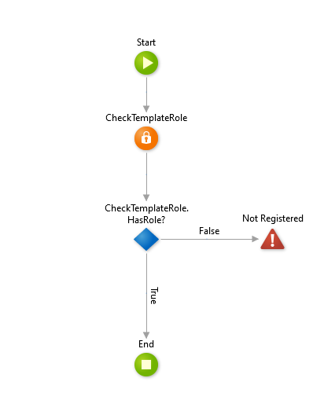

# Server Action Security

Following [ADR 3 Core Services must be secured](ADR-003-secure-core-services.md) we will always check the authentication and authorization in server side logic.

Each server action must include the following checks
* Is the user logged in?
* Has the user the proper authorization to perform this action?

We can easily implement this by using the `Check<rolename>Role(UserId:)` function. As a consequence we need an authentication method for system tasks such as timers and processes because there is no user there. For this we will use a "Service Account" to login before performing logic in Timers, BPT etc.

For uniform and easy implementation you must use the following template logic from the `CoreServicesStencil_Pat` module:

## TemplateRoleCheck
Checks if the user has the Template role and throws a not registered exception if False

### Implementation steps

1. Setup the required roles in your application security module
2. Copy action `TemplateRoleCheck` to the security module
3. Rename `TemplateRoleCheck` to `<YourRoleName>RoleCheck` and replace the `CheckTemplateRole` action by
`Check<YourRoleName>Role`

## ServiceAccountLogin
Example Action to login the ServiceAccount
### Implementation steps

1. Configure the Service Account
  * Setup a username and password for the ServiceAccount
  * Store the ServiceAccount credentials in your configuration (do not forget to encrypt the password)
2. Create an action to login the ServiceAccount using the configured credentials.

## Timer_TemplateAction
Example how to use a system account in Timers, BPT, etc.

### Implementation steps
1. Copy the Timer_TemplateAction to your module
2. Rename it to your needs
3. Implement the timer logic
