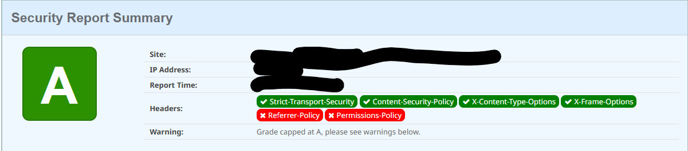

# {{page.title}}

{{page.subtitle}}

## Introduction

In this guide I'll provide step by step instructions how to secure your OutSystems runtime environment and Applications. If you apply this guide and follow the recommendations as described in [Develop secure OutSystems apps](https://success.outsystems.com/support/security/develop_secure_outsystems_apps/), your application should be protected.

⚠️ Please note that if you require maximum security you should consider using [Outsystems Sentry](https://www.outsystems.com/sentry/).

Applying these security settings is also a good preparation for a [Penetration Test](https://en.wikipedia.org/wiki/Penetration_test).

## Security headers initial check

Before applying the settings we check the headers of your application at [securityheaders.com](https://securityheaders.com).
These are the initial results:


Plenty of room for improvement!

First let's describe what these missing headers are:

| Header | Description | Status |
| ------ | ----------- | ------ |
| Strict-Transport-Security | [**HTTP Strict Transport Security (HSTS)**](https://en.wikipedia.org/wiki/HTTP_Strict_Transport_Security) is a policy mechanism that helps to protect websites against man-in-the-middle attacks such as protocol downgrade attacks[1] and cookie hijacking. It allows web servers to declare that web browsers (or other complying user agents) should automatically interact with it using only HTTPS connections, which provide Transport Layer Security (TLS/SSL), unlike the insecure HTTP used alone. HSTS is an IETF standards track protocol and is specified in [RFC 6797](https://datatracker.ietf.org/doc/html/rfc6797).<br>Recommended value "Strict-Transport-Security: max-age=31536000; includeSubDomains". | Permanent: standard |
| **Content-Security-Policy** | [Content Security Policy CSP](https://en.wikipedia.org/wiki/Content_Security_Policy) is a computer security standard introduced to prevent cross-site scripting (XSS), clickjacking and other code injection attacks resulting from execution of malicious content in the trusted web page context. | Working Draft |
| **X-Frame-Options** | *X-Frame-Options tells the browser whether you want to allow your site to be framed or not. By preventing a browser from framing your site you can defend against attacks like clickjacking. Recommended value "X-Frame-Options: SAMEORIGIN".* | Obsolete |
| **Referrer-Policy** | Referrer Policy is a new header that allows a site to control how much information the browser includes with navigations away from a document and should be set by all sites. | Working Draft |
| **Permissions-Policy** | Permissions Policy is a new header that allows a site to control which features and APIs can be used in the browser. | Working Draft |

## Apply Security settings to your environment

### Enforce HTTPS Security

We will add the following headers using LifeTime;

* Strict Transport Security
* Secure Cookies

Do the following in the infrastructure management console (LifeTime):

1. Select the "Environments" section to see all environments
1. Select the environment that you want to configure by clicking on it
1. Click the "More Security Settings" link on the bottom section of the page
1. Configure the security settings:
    1. Switch **Enable HTTP Strict Transport Security (HSTS)** On
    1. Switch **Force HTTPS for exposed integrations in Web Applications** On
    1. In the Cookies section switch **Secure** On
    1. Save the settings
    1. You will now see a warning message: *"Changes saved. Apply them using a solution containing all modules."* For now we ignore this message, we will republish the apps to apply the changes when all options are set

### Enable Content Security Policy

1. Select the "Environments" section to see all environments
1. Select the environment that you want to configure by clicking on it
1. Click the "More Security Settings" link on the bottom section of the page
1. Configure the security settings:
    * Switch **Enable Content Security Policy** On
    * Click on **Save**, this will create the default CSP Directives
    * To enable the use of google fonts edit the CSP Directives to add the values below:
        * Font-src: self<br>data:<br>`https://fonts.gstatic.com`
        * Object-src: `none`
        * Style-src: self<br>`https://fonts.googleapis.com`
1. Save the settings. (We will republish the apps to apply the changes when all options are set.)

### Apply Setting to the factory

As explained in [\[Documentation\] Applying Configurations in Service Center](https://success.outsystems.com/documentation/11/managing_the_applications_lifecycle/deploy_applications/configure_application_settings_after_deployment/applying_configurations_in_service_center/). We must now recompile all applications to apply the configuration settings.

1. Go to the enviroments service center
1. Click on **Apply settings to the factory** and wait until the settings have been applied
1. Go to Factory > Solutions
1. Create a new solution
    1. Name: `All'
    1. Go to tab components and click on **Associate All Modules/Extensions**
    1. Click on **Save** to save the solution
    1. Go the versions tab
    1. Select the current running version and click on **Publish**
    1. Click on **OK** to confirm the action.

### Recheck the security headers

1. Check the headers of your application at [securityheaders.com](https://securityheaders.com). The result now look like this: 
1. Validate the CSP at [csp evaluator](<https://csp-evaluator.withgoogle.com/>)   (We ignore the 'unsafe-inline' error as it is inserted by the platform)

## Adding headers with the Factory Configuration App

⚠️ **Warning:** This component is not supported in Personal or Trial environments. Personal and Trial are offered on shared infrastructure where advanced configurations may affect other users and are therefore not supported.

We now have to add the missing **Referrer-Policy** and **Permissions-Policy** headers. For this we will use the **Factory Configuration** forge app.

1. Install the [Factory Configuration](https://www.outsystems.com/forge/component-overview/25/factory-configuration) app from the forge
1. Navigate to Factory Configuration > Shared Configurations > Create New Shared Configuration
1. Insert the following content in the form of the Shared Configuration:

    **Name:** A name that you find appropriate and indicates what the setting does, e.g., *'Security Headers'*.

    **Kind:** Select *'web.config_XSL'* from the dropdown.

    **Value**: The XSL template that finds the element `/configuration/system.webServer/httpProtocol/customHeaders` and adds to it a new add element.

    ```xml
    <?xml version="1.0" encoding="UTF-8"?>
    <xsl:stylesheet version="1.0" xmlns:xsl="http://www.w3.org/1999/XSL/Transform">

        <xsl:output method="xml" indent="yes" encoding="UTF-8"/> 

        <xsl:template match="@*|node()">
            <xsl:copy>
                <xsl:apply-templates select="@*|node()"/>
            </xsl:copy>
        </xsl:template>
     
        <xsl:template match="/configuration/system.webServer/httpProtocol/customHeaders">
            <xsl:copy>
                <xsl:apply-templates select="@*|node()"/>
                <add name="X-Frame-Options" value="SAMEORIGIN" />
                <add name="X-XSS-Protection" value="1; mode=block" />
            </xsl:copy>
        </xsl:template>

    </xsl:stylesheet>
    ```

    To set the Referer-Policy header insert this add statment:

    ```xml
    <add name="Referrer-Policy" value="no-referrer" />
    ```

    To set the Permissions-Policy header insert this add statment:

    ```xml
    <add name="Permissions-Policy" value="accelerometer=(), ambient-light-sensor=(), autoplay=(), battery=(), camera=(), cross-origin-isolated=(), display-capture=(), document-domain=(), encrypted-media=(), execution-while-not-rendered=(), execution-while-out-of-viewport=(), fullscreen=(), geolocation=(), gyroscope=(), keyboard-map=(), magnetometer=(), microphone=(), midi=(), navigation-override=(), payment=(), picture-in-picture=(), publickey-credentials-get=(), screen-wake-lock=(), sync-xhr=(), usb=(), web-share=(), xr-spatial-tracking=(), clipboard-read=(), clipboard-write=(), gamepad=(), speaker-selection=(), conversion-measurement=(), focus-without-user-activation=(), hid=(), idle-detection=(), interest-cohort=(), serial=(), sync-script=(), trust-token-redemption=(), window-placement=(), vertical-scroll=()"/>
    ```

    You can retrieve the complete file here [SecurityHeaders.xml](SecurityHeaders.xml)

1. After creating the template, we need to associate it to the module(s). To do this, one has to:

    1. Navigate to Factory Configurations > eSpaces
    1. Select the eSpace(s) that that requires having this setting
    1. In the eSpace page, select the Shared Configuration created in step 3 from the dropdown and click the Associate button
    1. Apply settings to the mentioned eSpace(s) for the configuration to be effective. You can do this by adding the necessary eSpace(s) to a Solution and publishing it

## Additional CSP settings on application level

We created an application with a product entity that contains an url to an external resource for the product picture. To be able to show the image we must add this resource domain in the Apps csp settings.

First we check the Error logs to see what's blocked:

1. Open Service Center
1. Go to monitoring
1. Select Errors
1. Enter `CSPReport` in the source filter field and click on filter
1. You will now see the CSP errors e.g,: `Content Security Policy blocked 'https://i.ibb.co/xDXpRt6/Automaticant.jpg'.`

We will now add `https://i.ibb.co` to the applications CSP directives:

1. Open LifeTime
1. Go to Applications
1. Select \<your application\>
1. Click on \<your application\>
1. Click on "Settings"
1. Turn **Enable Content Security Policy** On
1. Add `https://i.ibb.co` to directuve **Img-src**
1. Click on Apply and confirm the action. You will now see a message : `Changes saved. The application needs to be published to use the new settings.`
1. Open to Service Center
1. Go to Factory > Applications
1. Select \<your application\>
1. Click on \<your application\>
1. Click on [Publish] to republish the application and apply the new settings.
1. Open the application to verify that there are no more errors

## References

* [\[Documentation\] Enforce HTTPS Security](https://success.outsystems.com/documentation/11/managing_the_applications_lifecycle/secure_the_applications/enforce_https_security/)
* [\[Documentation\] Apply Content Security Policy](https://success.outsystems.com/documentation/11/managing_the_applications_lifecycle/secure_the_applications/apply_content_security_policy/)
